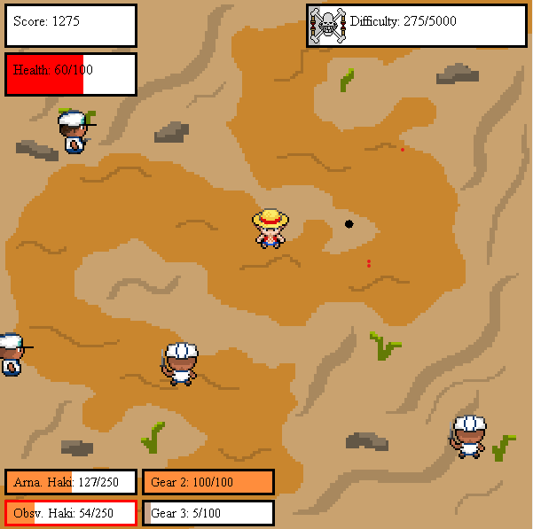

# CSC1351 Final Project: One Piece-themed Game

This is a game I made for a final project during my Freshman year of college. It utilizes **BasicGraphics**, 
  a package made by my professor to give us a barebones game engine to work with. **BasicGraphics** is not included
  in the files.

---

## How to run:

Clone the repository:
```bash
git clone https://github.com/bengutow1/2024_game_finalproj.git
```
Step into the ```dist/``` folder in the newly cloned directory:
```bash
cd 2024_game_finalproj/dist
```
Run the jar file using:
```bash
java -jar 2024-spring-final-project.jar
```

## Controls:
**WASD**: move the character around  
**Arrow Keys**: punch in the direction that you press  
**Q**: use Arnament Haki ability (gives extra damage and a damage radius to each punch)  
**E**: use Observation Haki ability (slows down everything but you)  
**2**: use Gear 2 ability (speeds you up, makes your punches faster and do more damage)  
**3**: use Gear 3 ability (makes your fists bigger and does more damage)  

## Basics:
Survive, get the highest score you can.

Killing enemies raises your score and your progress to the next difficulty.
* There are three difficulties: easy, medium, hard (displayed by different pirate flags)
  * Easy: Private (melee) + Marksman (shoots bullets)
  * Medium/Hard: Adds Grenadier (throws grenades)
  * Max enemies increase per difficulty
  * Fully heal when advancing to the next difficulty

When the ability bars turn golden, you can use them.
* Fill up ability bars by defeating enemies. The numbers on each are: (Current XP/Max XP)
  * Arnament Haki: usable after 50 XP
  * Observation Haki: usable after 100 XP
  * Gear 2 & 3: usable when full
* Arnament Haki and Observation Haki don't need max XP to be usable

## Art



* All of the pixel art is done by me, located in the ```images``` folder


